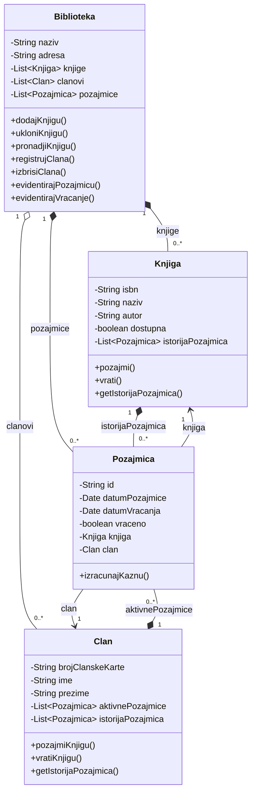

```mermaid
classDiagram
    class Biblioteka {
        -String naziv
        -String adresa
        -List~Knjiga~ knjige
        -List~Clan~ clanovi
        -List~Pozajmica~ pozajmice
        +dodajKnjigu()
        +ukloniKnjigu()
        +pronadjiKnjigu()
        +registrujClana()
        +izbrisiClana()
        +evidentirajPozajmicu()
        +evidentirajVracanje()
    }
    
    class Knjiga {
        -String isbn
        -String naziv
        -String autor
        -boolean dostupna
        -List~Pozajmica~ istorijaPozajmica  <!-- DODATO -->
        +pozajmi()
        +vrati()
        +getIstorijaPozajmica()
    }
    
    class Clan {
        -String brojClanskeKarte
        -String ime
        -String prezime
        -List~Pozajmica~ aktivnePozajmice
        -List~Pozajmica~ istorijaPozajmica  <!-- DODATO -->
        +pozajmiKnjigu()
        +vratiKnjigu()
        +getIstorijaPozajmica()
    }
    
    class Pozajmica {
        -String id
        -Date datumPozajmice
        -Date datumVracanja
        -boolean vraceno
        -Knjiga knjiga  <!-- Referenca na Knjigu -->
        -Clan clan      <!-- Referenca na Člana -->
        +izracunajKaznu()
    }
    
    %% Veze sa referencama
    Biblioteka "1" *-- "0..*" Knjiga : knjige
    Biblioteka "1" o-- "0..*" Clan : clanovi
    Biblioteka "1" *-- "0..*" Pozajmica : pozajmice
    
    %% Dvosmerne veze - sada imaju smisla
    Clan "1" *-- "0..*" Pozajmica : aktivnePozajmice
    Knjiga "1" *-- "0..*" Pozajmica : istorijaPozajmica
    
    %% Asocijacije unutar Pozajmice
    Pozajmica --> "1" Clan : clan
    Pozajmica --> "1" Knjiga : knjiga
```
