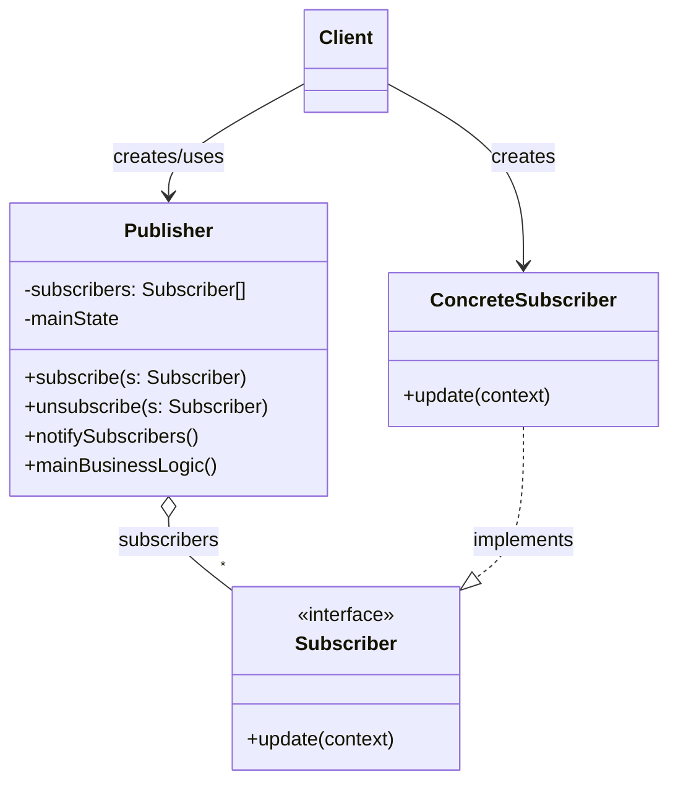
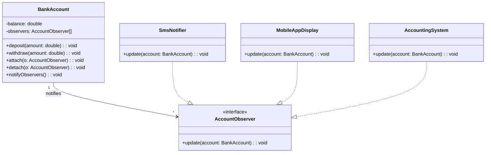

Observer definicija :

Observer je projektni obrazac koji uvodi one-to-many zavisnost između objekata:
jedan objekat Subject/Publisher drži stanje, a više objekata Observer/Subscriber se „pretplate“ na njega.
Kad god se stanje subjekta promeni, on automatski obaveštava sve svoje posmatrače, koji zatim ažuriraju svoje stanje.

Observer generelni primer:

Observer primer upotrebe obrasca:

